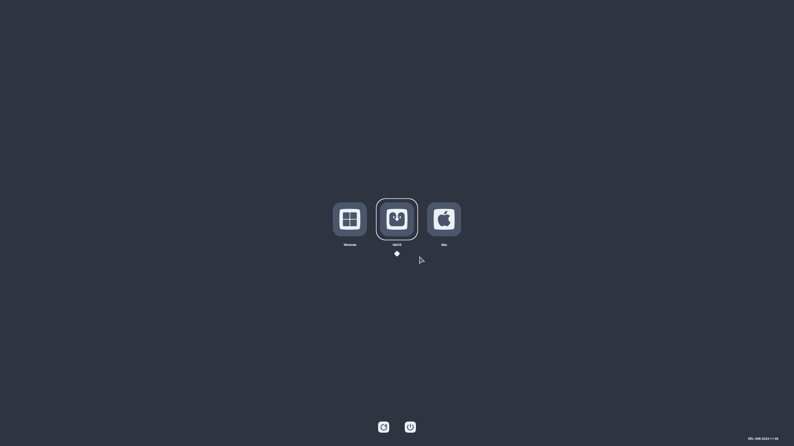
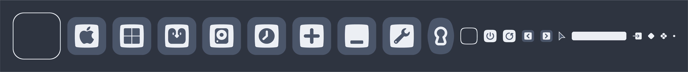

# Nordic OpenCanopy

A clean theme using the [Nord](https://github.com/nordtheme/nord) color palette for [OpenCore](https://github.com/acidanthera/OpenCorePkg).

## 🌟 Preview

## ✨ Features
- Custom icons for various operating systems including macOS, Windows, and Linux.
- High-resolution backgrounds to support various displays.
- Cohesive design, all theme assets have been carefully crafted to fit a minimalist and uncluttered aesthetic.
- Easy installation and configuration.

## 🛠️ Installation
1. Download the theme files from the 'Releases' section.
2. Copy the theme folder into your EFI partition under `EFI/OC/Resources/Image`.
3. Rename the correct `Background_<resolution>.icns` to `Background.icns` according to your display.
4. Update your `config.plist` to use the new theme. 
    - `Misc -> Boot -> PickerMode` : `External`.
    - `Misc -> Boot -> PickerAttributes` : `17`.
    - `Misc -> Boot -> PickerVariant` : `Etho\Nordic`.

Check this [guide](https://dortania.github.io/OpenCore-Post-Install/cosmetic/gui.html) and the [OpenCanopy documentation](https://dortania.github.io/docs/latest/Configuration.html#opencanopy) for further information.

## 🧩 Compatibility
Compatible with OpenCore versions 0.7.0 and newer.

## 🏆 Credits
- [Acidanthera](https://github.com/acidanthera) for [OpenCore](https://github.com/acidanthera/OpenCorePkg).
- [chris1111](https://github.com/chris1111) for the handy [OpenCanopy Generator](https://github.com/chris1111/OpenCanopy-Generator) tool.
- [ful1e5](https://github.com/ful1e5) for the great [Bibata](https://github.com/ful1e5/Bibata_Cursor) cursor theme.
- [svengreb](https://github.com/svengreb) for the [Nord](https://github.com/nordtheme/nord) color palette

---

Appreciate this theme? Consider starring it to show your support ⭐

